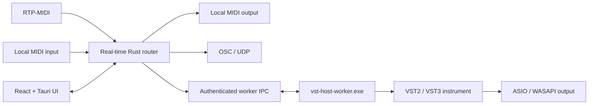

<p align="center">
  
</p>

<h1 align="center">OSCMidi</h1>

<p align="center">
  A low-latency Windows bridge for RTP-MIDI, local MIDI, OSC and isolated VST instruments.
</p>

<p align="center">
  <a href="https://github.com/GoulagmanYt/RTP-OSC-Midi-tool/actions/workflows/build-windows.yml">
    
  </a>
  
  
  
  
</p>

<p align="center">
  <a href="https://github.com/GoulagmanYt/RTP-OSC-Midi-tool/releases/latest">Download</a>
  ·
  <a href="#quick-start">Quick start</a>
  ·
  <a href="#architecture">Architecture</a>
  ·
  <a href="#development">Development</a>
  ·
  <a href="CHANGELOG.md">Changelog</a>
</p>

---

OSCMidi connects network sessions, physical or virtual MIDI devices, OSC targets and software instruments from one desktop interface. Its Rust routing engine prioritizes the audio path, while every VST runs in a supervised sidecar process so a faulty plug-in cannot take down the main application.

> [!IMPORTANT]
> OSCMidi is designed for **Windows x64 only**. Its ASIO, WASAPI, VST and packaging layers are not intended for macOS or Linux.

## Highlights

| Area | Capabilities |
| --- | --- |
| MIDI networking | RTP-MIDI server, participant discovery and mDNS advertisement |
| Routing | RTP-MIDI and local MIDI input to MIDI Thru, OSC and VST destinations |
| VST hosting | VST2 and VST3 instruments, plug-in scanning, native editors and persistent state |
| Process isolation | One supervised `vst-host-worker.exe` process for the active plug-in and audio stream |
| Low-latency audio | ASIO and WASAPI backends with configurable sample rate and buffer size |
| Reliability | Bounded real-time queues, deadline metrics, heartbeat supervision and emergency MIDI reset |
| Diagnostics | Live routing status, logs, stress tests and detailed developer-only audio metrics |
| Interface | Responsive React desktop UI with English and French translations |

## Download

Download the latest build from the [GitHub Releases page](https://github.com/GoulagmanYt/RTP-OSC-Midi-tool/releases/latest).

| Package | Recommended use |
| --- | --- |
| MSI installer | Normal installation with Windows shortcuts and uninstall support |
| Portable ZIP | No installation; extract the complete archive and run `OSCMidi.exe` |

The portable package contains both `OSCMidi.exe` and `vst-host-worker.exe`. Keep them in the same directory: the application intentionally does not load VST DLLs in its own process.

> [!NOTE]
> Release binaries are currently unsigned. Windows can therefore display an unknown-publisher or SmartScreen warning when opening a downloaded build.

## Quick start

1. Install OSCMidi with the MSI, or extract the complete portable ZIP.
2. Open **RTP-MIDI** and configure the local session name and ports.
3. Open **Routing** and select the required MIDI, MIDI Thru and OSC destinations.
4. To use a software instrument, open **Audio**, select an ASIO or WASAPI device, then choose a compatible VST2 or VST3 instrument.
5. Start the bridge and monitor its state from the dashboard.

For a first audio test, start with **48 kHz / 512 samples**. Reduce the buffer only after the complete route is stable with the selected driver and plug-in.

## Architecture



The desktop process owns configuration, routing and supervision. The worker owns the active VST instance, its native editor, the audio device and the real-time callback. Control and MIDI messages cross a versioned, authenticated local IPC channel. If the worker crashes or stops responding, the desktop interface remains available and can return the audio system to a coherent state.

More detail is available in [src-tauri/ARCHITECTURE.md](src-tauri/ARCHITECTURE.md) and [docs/VST_WORKER_PHASE2.md](docs/VST_WORKER_PHASE2.md).

## System requirements

### Runtime

- Windows 10 or Windows 11, x64.
- Microsoft Edge WebView2 Runtime.
- A WASAPI-compatible device or an installed ASIO driver.
- Optional x64 VST2 or VST3 instrument plug-ins.
- A local MIDI device or RTP-MIDI peer when using those routes.

OSCMidi scans standard Windows VST locations. Unsupported architectures, effects and plug-ins that fail compatibility probing are excluded from the instrument list.

### Development

- Node.js 20.19+ or 22.12+, with npm.
- Stable Rust toolchain installed through `rustup`.
- Visual Studio Build Tools with the x64 MSVC C++ toolchain and a Windows SDK.
- CMake.
- LLVM/Clang with `clang.exe` and `libclang.dll`.
- Git.
- The `ASIOSDK` directory included in this repository.

Install the main tools on a fresh Windows environment:

```powershell
winget install OpenJS.NodeJS.LTS
winget install Rustlang.Rustup
winget install Microsoft.VisualStudio.2022.BuildTools --override "--wait --passThru --add Microsoft.VisualStudio.Component.VC.Tools.x86.x64 --add Microsoft.VisualStudio.Component.Windows11SDK.22000"
winget install Kitware.CMake
winget install LLVM.LLVM
```

## Development

Install dependencies and start the Tauri development application:

```powershell
npm ci
npm run tauri:dev
```

The Tauri development command builds and stages the debug VST worker before starting Vite and the desktop shell.

### Common commands

| Command | Purpose |
| --- | --- |
| `npm run tauri:dev` | Build the debug worker and start the desktop application |
| `npm run lint` | Run ESLint and TypeScript checks |
| `npm test` | Run the frontend test suite once |
| `npm run build` | Build the frontend production bundle |
| `npm run tauri:build` | Build the release application and MSI |
| `npm run prepare:vst-worker:dev` | Build and stage only the debug VST worker |
| `npm run prepare:vst-worker:release` | Build and stage only the release VST worker |

### Full validation

```powershell
npm run lint
npm test
npm run prepare:vst-worker:dev

cargo fmt --manifest-path src-tauri/Cargo.toml --package osc-midi-bridge -- --check
cargo clippy --manifest-path src-tauri/Cargo.toml --all-targets --all-features -- -D warnings
cargo test --manifest-path src-tauri/Cargo.toml --all-targets --all-features

cargo fmt --manifest-path tools/diagnostics/Cargo.toml --package oscmidi-diagnostics -- --check
cargo clippy --manifest-path tools/diagnostics/Cargo.toml --target-dir tools/diagnostics/target --all-targets -- -D warnings
```

Developer diagnostics are kept outside the packaged application:

```powershell
cargo build --manifest-path tools/diagnostics/Cargo.toml --target-dir tools/diagnostics/target
```

## Windows release build

Run the complete local build from the repository root:

```bat
build_windows.bat
```

The script validates the toolchain, installs clean frontend dependencies, runs frontend and Rust checks, builds the worker, application and MSI, exports the deliverables, then removes generated dependencies and compilation caches. Progress and command output remain visible throughout the build.

Successful outputs are preserved in `artifacts\`:

| Output | Description |
| --- | --- |
| `portable\` | Ready-to-run folder containing both required executables |
| `OSCMidi_*_portable.zip` | Complete portable distribution |
| `OSCMidi_*.msi` | Windows installer |
| `SHA256SUMS.txt` | Integrity hashes for the generated deliverables |
| `logs\` | Ten most recent build logs |

Run `artifacts\portable\OSCMidi.exe` directly, install the MSI, or copy/extract the complete portable folder. `OSCMidi.exe` intentionally requires `vst-host-worker.exe` beside it and must never be copied alone.

The cleanup runs after both successful and failed builds. It removes `node_modules`, Rust target directories, generated VST dependencies, staged sidecars and frontend output. Before deleting a generated directory, the script refuses to continue if Git reports any tracked file inside it. Deliverables, current and legacy logs, diagnostic reports and developer-managed Python environments are preserved. The next invocation is consequently a full clean build.

## Automated releases

[Build Windows App](.github/workflows/build-windows.yml) runs on pushes to `main`, version tags and manual dispatch. It validates that `package.json`, `Cargo.toml` and `tauri.conf.json` use the same version, then publishes a downloadable workflow artifact.

A `v*` tag also creates or updates the corresponding GitHub Release with the MSI, portable ZIP and checksum file:

```powershell
git tag v2.1.0
git push origin v2.1.0
```

The tag must exactly match the application version.

## Project layout

| Path | Responsibility |
| --- | --- |
| `src/` | React UI, pages, providers, translations and frontend tests |
| `src-tauri/src/application/` | Application services exposed to Tauri commands |
| `src-tauri/src/bridge/` | MIDI routing, lifecycle and metrics |
| `src-tauri/src/audio/` | Audio engine, callbacks, plug-in lifecycle and editor integration |
| `src-tauri/src/vst_worker/` | IPC protocol and worker supervision |
| `src-tauri/src/bin/vst_host_worker.rs` | Isolated VST/audio worker entry point |
| `vendor/rack/` | Local VST3 host integration and native bridge |
| `tools/diagnostics/` | Developer-only MIDI, RTP and VST diagnostics |
| `scripts/` | Worker preparation, build and stability utilities |
| `ASIOSDK/` | ASIO SDK sources required by CPAL ASIO builds |

## Runtime data

Configuration, logs and VST states are stored under the Windows roaming application-data directory:

| Data | Path |
| --- | --- |
| Configuration | `%APPDATA%\OSCMIDI\OSCMIDI\config\config.yaml` |
| Application log | `%APPDATA%\OSCMIDI\OSCMIDI\config\app.log` |
| VST state | `%APPDATA%\OSCMIDI\OSCMIDI\config\vst_state\` |

## Troubleshooting

### A plug-in is missing

Only compatible x64 instrument plug-ins are displayed. Effects, unsupported architectures and candidates that fail or time out during probing are intentionally filtered. Refresh the instrument list after installing or moving a plug-in.

### Audio drops or XRuns are reported

- Increase the audio buffer to 512 or 1024 samples.
- Prefer a native ASIO driver when one is available.
- Confirm that the selected driver really accepts the requested buffer size.
- Close other applications competing for the audio device or real-time CPU time.
- Compare the result with a lightweight known-good instrument.

If the VST processing time itself exceeds the audio period, the stable solution is a larger buffer or lower plug-in polyphony/quality.

### The portable build cannot start the VST worker

Install the MSI, run `artifacts\portable\OSCMidi.exe`, or extract the entire ZIP. Confirm that `OSCMidi.exe` and `vst-host-worker.exe` are in the same directory. Do not distribute or move the application executable on its own.

### Local development shows `ERR_CONNECTION_REFUSED`

Close every stale `OSCMidi.exe` instance, rebuild the worker and restart `npm run tauri:dev`. A previously running binary can keep an outdated WebView development URL.

### sforzando state does not restore

The host intentionally avoids internal VST3 state restoration for sforzando because the plug-in has dedicated teardown behavior. Keep the ARIA resource paths valid and use its ARIA files, such as `default.ariax`, for persistent configuration.

## Contributing

1. Create a focused branch from `main`.
2. Keep changes scoped and preserve the worker isolation boundary.
3. Run the relevant frontend and Rust checks.
4. Include test or build evidence in the pull request description.

Please review [CHANGELOG.md](CHANGELOG.md) and the architecture documents before changing the real-time audio or worker lifecycle.

## License

This repository does not currently include an explicit project license. Unless a license is added, the source code remains subject to the default copyright restrictions.
