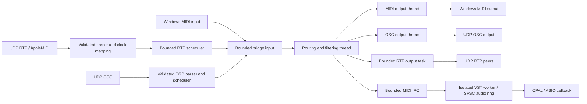

# MIDI/RTP reliability changes

This audit and implementation apply to the local working tree, including the
existing audio/EQ changes. Those changes were preserved. No deployment or release
was performed.

## Current validation status (2026-09-16)

The implementation and protocol regressions are committed. The latest checks
passed 150 application tests and 87 vendor tests; three hardware-specific opt-in
tests remain ignored. Application/vendor Clippy passed with warnings denied.
The one-hour RTP endurance passed 3,573 reconnects and 1,143,360 matched note pairs.

**Open:** extended audio validation on the selected Splice/Voicemeeter rig fails
its memory bound under continuous note bursts, despite zero reported drops/xruns.
Active/idle cycling and a Windows allocator-only experiment did not resolve it.
Do not interpret earlier short successful audio runs as a passed long memory soak.
Exact reports and experiment limitations are in AUDIO_RELIABILITY_RESULTS.md.

## Architecture and audit priorities

The target is Windows/MSVC with Rust 1.90.0, Tauri 2 and a TypeScript frontend.
Tokio owns network/session and worker-control tasks. `midir` exposes installed
Windows MIDI endpoints; CPAL supplies audio, including ASIO. VST hosting runs in
an isolated child process in production. Virtual MIDI/audio endpoints depend on
installed drivers; the bridge does not create an operating-system MIDI driver.



RTP-origin frames are excluded from RTP forwarding; OSC-origin frames are
excluded from OSC output. Driver sends run in destination threads, GUI events
have a separate emitter, and audio submission uses nonblocking queues. Remaining
management/send-order async mutexes, configuration locks, callback plugin
`try_lock`, and lifecycle joins are described below; there is no claim that every
operation in this architecture is lock-free.

| Priority | Defects addressed | Verification |
| --- | --- | --- |
| Tier 0: stuck notes / lifetime | Lost critical releases, stale queues after panic, eviction reordering, detached worker tasks, restart-after-stop, session-owner leaks | Overflow and note-accounting tests, worker crash/hang fixtures, cancellation and socket-release tests |
| Tier 1: protocol | Truncated packet acceptance, running status, zero-velocity notes, 14-bit byte order, sequence rollover, CK deadlines, SysEx assembly, OSC padding/timetags | Parser vectors, malformed UDP injection, two-session tests, OSC round trips and scheduled bundles |
| Tier 2: allocation / contention | Repeated packet allocation, callback-list locks, route locks, MIDI submission telemetry locks, per-packet trace formatting | Stable-storage tests, concurrent publication/lock-contention regressions, production-worker telemetry |

Patch boundaries below form the independently committed refactoring roadmap.
The explicit-limits section distinguishes implemented recovery from unsupported
protocol forms and unproven absolute timing or loss guarantees.

## Patch boundaries

1. **Wire parsing:** validate complete packets before dispatch, bound delta-time
   decoding, preserve running status across real-time messages, normalize
   velocity-zero Note-On, fix 14-bit byte order and Z-flag encoding, and reject
   oversized outgoing batches. Packet errors propagate without panicking.
2. **Sessions and timing:** correlate invitations by token and endpoint, validate
   session version and clock count, emit departure events from all removal paths,
   expire invitations and both peer roles, and join registered background tasks.
   CK exchanges now supply monotonic deadlines with bounded integer rate
   compensation. Event deltas accumulate modulo 2^32.
3. **Bridge and destinations:** validate injected frames, use nonblocking fanout,
   invalidate old output generations after a fault, bound each routing batch,
   and track active external MIDI notes in the destination's owning thread.
   Device/filter changes flush notes; hotplug loss triggers recovery. OSC send
   errors propagate, failed sustain sends are not cached, and telemetry cannot
   wait on the activity lock in the routing path.
4. **Worker and exit:** emergency reset travels in the ordered MIDI pipe. Both
   its upstream backlog and the callback's pre-reset ring contents are discarded.
   Tauri exit waits for bridge/audio shutdown, and an RTP session started before
   the bridge is also stopped.
5. **Session ownership follow-up:** only public session handles own the
   cancellation guard. Dropping a value clone does not cancel surviving owners,
   while dropping the last owner cancels background contexts. Graceful stops
   serialize, join reception and maintenance tasks before draining peers, clear
   pending invitations, and prevent invitations on stopped sessions. BY uses
   best-effort nonblocking UDP sends so socket pressure cannot delay shutdown.
   Sequence and fragment history belong exclusively to the MIDI receive task.
   Session metadata is published through immutable snapshots; packet reception
   never acquires the participant-management lock. One listener snapshot covers
   each packet. Reconnecting the same SSRC
   resets sequence history, verified through UDP injection.
   Port zero now reserves an actual adjacent ephemeral control/MIDI pair, with
   bounded retries on adjacent-port contention, and advertises its bound control
   port. Invalid port 65535 returns an error without trace-field overflow. The
   logging example now handles Ctrl+C on both Windows and Unix.
6. **Regression harness:** malformed byte campaigns, real UDP session injection,
   sequence gaps/rollover/late packets, timestamp vectors, real-time interleaving,
   10,000 matched note lifecycles through bounded queues, output overflow,
   ordered IPC reset, callback backlog invalidation, and OSC byte alignment and
   round trips. Session regressions also verify retained clones communicate
   after the original is dropped, final-owner drop releases ports, and concurrent
   graceful stops both wait for registered tasks.

## Interfaces and runtime policy

- Worker protocol **8** requires the matching worker executable. A one-byte
  System Reset on the private MIDI pipe requests a callback reset; it is not
  passed to the instrument as an ordinary channel message. Rebuild both packaged
  worker architectures before creating a release.
- The vendored `TimestampedMidiMessage` includes a monotonic `deadline`.
  `StreamFaultEvent` identifies malformed traffic from an established endpoint
  so a corrupt final Note-Off does not require another packet to trigger recovery.
- Public bridge injection reports invalid input and queue exhaustion as errors.
  Audio output metrics count accepted submissions, not failed attempts or proof
  of physical playback.
- RTP scheduling uses a preallocated 4,096-entry heap, with stable ordering for
  equal deadlines. The fixed 3 ms delay was removed. Unsynchronized peers use
  arrival time plus intra-packet deltas until a clock exchange completes.
  Messages more than 10 seconds ahead are rejected, not played prematurely.
- Pending invitations expire after 30 seconds and are capped at 256; connected
  peers are capped at 128. Both session roles expire after 60 seconds without a
  valid synchronization packet, checked on the 10-second maintenance cycle.
- Journals validate container lengths, channel order, chapter boundaries and
  parameter/system field layouts before dispatch. Covering journals containing
  Chapters P/C/M/W/N/E/T/A recover programs/banks, controller/parameter state,
  pitch, notes and pressure. Ambiguous reference counts, missing controller
  values, missing source context and unnegotiated recovery forms retain the reset
  fallback. A parsed journal is not necessarily a recoverable journal.
- A proven forward sequence gap without supported recovery triggers a reset;
  late/duplicate packets are discarded. There is no added sequence
  reorder delay. This preserves the latency policy at the cost of interrupted
  notes when the network reorders packets.
- A reset intentionally releases all destinations rather than attempting to
  reconstruct musical intent from missing messages. Queue pressure can still
  drop events; reset generations prevent replay of obsolete queued Note-Ons.
- `midi-types` 0.2.1 is vendored with two corrected assertions for valid value
  127. See `vendor/midi-types/PATCHES.md`; all three Cargo roots use this patch.

## Validation

Run from the repository root with the installed CMake and libclang on the process
environment. For tests/checks without packaged sidecars, use the same
`TAURI_CONFIG={"bundle":{"externalBin":[]}}` override as the worker preparation
script. This changes build inputs only, not the tracked application config.

```text
cargo test --manifest-path vendor/rtpmidi/Cargo.toml --locked --tests
cargo clippy --manifest-path vendor/rtpmidi/Cargo.toml --locked --tests -- -D warnings
cargo test --manifest-path src-tauri/Cargo.toml --locked --all-targets --all-features
cargo clippy --manifest-path src-tauri/Cargo.toml --locked --all-targets --all-features -- -D warnings
cargo fmt --manifest-path src-tauri/Cargo.toml --all -- --check
cargo fmt --manifest-path vendor/rtpmidi/Cargo.toml -- --check
npm run lint
npm test
npm run build
```

Frontend validation used the installed Node 26 runtime; the machine's default
Node 20 does not satisfy the existing Vite/jsdom dependency requirements.

The final Windows Rust validation passed 149 application tests and 76 vendored
RTP tests. Three opt-in third-party instrument tests remain ignored. Application
and RTP Clippy checks passed with warnings denied, as did formatting checks.
The rebuilt production worker and diagnostic then passed a fresh 10,000-note
Splice/Voicemeeter run; its raw JSON is tracked in `docs/measurements/`.

## Explicit limits

This is a reliability pass over implemented routes, not a certification of full
RFC 6295/OSC support. Default channel recovery now includes P/C/M/W/N/E/T/A,
enhanced Chapter C with a known count baseline, and system D/V/Q/F/X recovery.
The later advanced-recovery section specifies bounds and the cases requiring
source state or negotiated renderer semantics. Complete RTP SysEx is forwarded to local MIDI
through the synchronized scheduler. A new borrowed timestamped event carries the
SSRC, RTP timestamp and monotonic deadline while retaining the legacy callback.
Reassembled SysEx uses the final segment deadline; this whole-message MIDI API
does not preserve inter-octet timing inside segmented commands. Segmented
SysEx is reassembled in 128 preallocated 64 KiB receive slots;
only completed messages are delivered. Cancellation, corruption, packet loss,
non-real-time interruption, and a 10-second inter-fragment timeout discard the
partial command. Covering Chapter X logs can reconstruct missing fragments, including a known
prefix identified by COUNT and FIRST. Insufficient coverage still requests reset. The
F5 dropped-EOX representation is normalized to a completed SysEx for MIDI APIs. Channel
voice messages use the same synchronized scheduler. UDP regression covers complete
and segmented SysEx delta times across timestamp rollover. Per-message packet/MIDI
trace formatting was removed from the vendor receive and send paths.
Malformed/duplicate packet diagnostics are sampled at power-of-two rejection
counts, so an error flood does not format a log for every datagram.

The application shares its atomic reset generation with RTP sessions. Before
processing another packet, each participant invalidates pre-reset note and SysEx
state. A UDP regression checks that an unchanged generation suppresses duplicate
journal Note-Ons, while a destination reset permits the journal to restore the
note. This tracks receiver knowledge, not acknowledgement of physical playback;
queued events can still be invalidated by subsequent overload recovery.

The 10,000-note regression exercises the actual bounded enqueue/fanout functions
and destination note tracking in a headless harness. It does not replace a
hardware/driver test. The existing ASIO/VST tests requiring installed instruments
remain opt-in. Three production-worker runs with the requested Splice/Voicemeeter
rig completed 10,000 notes each; see [measurements and reproduction](AUDIO_RELIABILITY_RESULTS.md).
No hard sub-millisecond or zero-network-loss claim follows from
these results: driver timing, Windows wake-up jitter, UDP delivery, and physical
disconnect recovery require measurements on the intended rig.

Protocol references: [RFC 6295](https://www.rfc-editor.org/rfc/rfc6295),
[Apple MIDI Network Driver Protocol](https://developer.apple.com/library/archive/documentation/Audio/Conceptual/MIDINetworkDriverProtocol/MIDI/MIDI.html),
and [OSC 1.0](https://opensoundcontrol.stanford.edu/spec-1_0.html).

## OSC input

OSC input is optional (off by default), configurable in the OSC page, and binds
127.0.0.1:9001 by default. Exact `/avatar/parameters/1` through `88` and `sustain`
accept a single zero/one integer or float, or OSC True/False. Notes map to MIDI
channel 1 and velocity 127. `/midi` accepts one OSC `m` argument with explicit
status and zero-filled unused data bytes; the port-id byte is not routed.
Input events are forwarded to MIDI/audio and suppressed on OSC output to prevent
feedback. OSC input does not require OSC output to be enabled.

The decoder validates i/f/s/b/h/t/d/m/T/F/N/I argument layouts, ASCII strings,
zero padding, complete consumption, signed lengths, and nested bundle ordering.
It reads borrowed packet slices and rejects a malformed packet before queuing
any of its events. Unknown exact addresses are ignored after validation;
address-pattern dispatch and array type tags are not implemented.

An input packet is limited to 1,024 mapped messages and 16 nested levels; the
scheduler holds at most 4,096 events and accepts deadlines up to ten seconds
in the future. NTP era rollover is handled using integer arithmetic. Immediate
nested bundles inherit their parent deadline. Due events are submitted in wire
order, and reception remains asynchronous while future bundles wait. This does
not provide transactional isolation from other MIDI producers in the shared
bridge queue or guarantee physical microsecond wake-up accuracy.

UDP tests cover timed/immediate interleaving, ordering and port release. Codec
tests cover all requested atomic layouts, truncation, padding, nested deadline
violations, capacity rejection, and NTP era rollover. Config changes replace the
input server with validation of its new bind address before stopping the old one.

## RTP output

The RTP page now offers an independent forwarding switch (off by default).
Local MIDI, injected events and OSC input can be forwarded to connected peers;
RTP-origin events are not echoed. Source routing profiles are applied before
forwarding. Output uses a separate bounded 2,048-frame queue and worker, with
nonblocking route lookup/submission on the processing path. Overflow is counted;
a lost critical release requests recovery. Reset generations discard stale work.

The sender releases sustain/notes/sound on all channels when a previously used
outbound route resets or stops, before session BY. An unused outbound route does
not send these controller resets. Socket operations are bounded by a 100 ms
failure timeout; failed resets are retried before new notes are sent. SysEx up
to 64 KiB is split into 1,024-byte RTP sublists and reassembled by the receiver.
The vendor sender snapshots only peer addresses in fixed storage, avoiding
copies of participant names and SysEx buffers for every outgoing packet.
The packet encoder now reuses a preallocated 1,214-byte buffer under the existing
send-order mutex. A 10,000-encode regression checks stable storage at maximum
packet size and rejection before mutation for oversized batches. This removes
the encoded-packet allocation; the public concurrent-send API retains its async
send-order lock, while destination, listener and route reads use atomic snapshots.

A two-session regression verifies MIDI forwarding, 2,700-byte segmented SysEx,
and remote panic. Queue tests cover echo prevention, critical overflow and a
concurrent configuration publication. The output worker checks reset generations on
a two-millisecond maintenance tick; no sub-millisecond reset bound is claimed.

## Configuration failure recovery

User save, reset and import operations serialize their bridge configuration
changes. OSC binding and RTP application precede the atomic configuration-file
write. A failed apply or write attempts to restore the previous runtime settings;
if restoration also fails, the returned error includes `rollbackError` alongside
the original error. Logging and discovery changes follow a successful commit.
Regression tests exercise an occupied UDP port, failed persistence, successful
persistence, and failed rollback. Recovery may interrupt sounding notes and may
fail if another process has occupied the previous port; this is not a guarantee
of uninterrupted reconfiguration. Instrument loading after import remains a
separate operation with its own error reporting.

RTP input and output routes now publish sender snapshots through ArcSwapOption.
Readers do not wait on configuration writers or drop messages merely because a
writer owns a lock. A concurrent route-swap regression delivers all 1,000 test
frames without requesting a reset. Queue exhaustion and route removal still have
the documented drop/reset policies.

Listener registration uses copy-on-write ArcSwap snapshots. A packet holds one
consistent callback list, while concurrent registration preserves all additions.
Callbacks now require `Send + Sync` because control and data notifications may
run concurrently; consumers must keep callbacks bounded. A regression retains an
old snapshot during four concurrent writers and verifies all 64 registrations
are present afterward. Publication allocates on the registration path; ordinary
notification does not clone the callback vectors. The management-writer and
outbound send-order mutexes still exist; packet reads do not acquire the former. ArcSwap's read guarantees are documented
by the [crate author](https://docs.rs/arc-swap/1.9.2/arc_swap/docs/performance/index.html).

## Audio overload and worker ownership

Audio backlog eviction preserves queue order. Previously, swapping an evicted
Note-On with the queue front could move a Note-Off behind sustain-on, keeping a
voice sounding. Regression tests cover both Note-On and controller eviction
without growing the preallocated queue. The direct-engine MIDI route is now an
atomic snapshot with a nonblocking producer guard and atomic drop telemetry.
The 64 yield/retry loop, runtime-mutex telemetry access and per-submission debug
formatting were removed. Producer contention or exhaustion requests an atomic
reset for critical releases. This bounds the submission path, not delivery under
unbounded load. Stable eviction remains linear in the bounded queue length.

Private audio packets and IPC frames validate complete short MIDI messages and
normalize velocity-zero Note-On. They reject malformed lengths/data and SysEx
instead of silently truncating a SysEx into the three-byte audio packet format.
SysEx still uses the external MIDI destination path; this does not add SysEx
instrument hosting support.

The worker supervisor also publishes its MIDI sender atomically and counts drops
without acquiring control/status locks. Lifecycle operations serialize; an epoch
invalidates delayed automatic restarts after explicit stop or a newer start.
Graceful stop waits for the session task after the audio acknowledgement and
aborts it on failure/timeout. Session pipe tasks are cancelled and joined on
normal teardown; cancellation also aborts their guards. Pending connection tasks
are cancelled if their starting future is dropped. Only public supervisor clones
retain the cancellation owner: dropping the last public owner aborts the active
session even if internal background contexts still exist. Child-process teardown
kills and reaps the worker even when job assignment was unavailable.
Cancelling an in-progress Stop also aborts its locally owned session task, rather
than detaching it when the control future is dropped.

Tests cover control/status/producer lock contention, deferred restart invalidation,
waiting past Stop acknowledgement, retained owner clones and final-owner
cancellation, in addition to the existing real worker crash/hang fixtures.
Control-stop acknowledgement and session joining each have a ten-second timeout;
a stop waiting for an in-progress load may also wait on that load's timeout.
These are bounded fallback policies, not a hard real-time shutdown guarantee.


## Receive ownership and bounded SysEx storage

The MIDI receive task owns its sequence, active-note and fragment state. Control
writers publish a participant snapshot on mutation while preserving publication
order under their management lock. A distinct connection identity prevents a
reconnected SSRC from inheriting old fragments or sequence state. Stale cleanup
also matches this identity before removal; BY validation and removal share one
management critical section. Snapshot reads continue while that lock is held.

Control datagrams arriving on the MIDI socket enter a preallocated 64-entry,
1,024-byte queue and a separate session-owned task. A blocked control operation
cannot suspend MIDI packet dispatch. Queue exhaustion rejects excess control
traffic, which peers can retry through their invitation/synchronization protocol.
The control task participates in cancellation and graceful joining. UDP receive
errors, including Windows oversized-datagram errors without a source address,
now emit a stream fault (SSRC zero when unavailable) so a lost final release
still requests destination recovery.

Each receiver reserves approximately 8 MiB for 128 fragment slots before its
receive loop. The application reserves another approximately 8 MiB in a shared
128-buffer pool for complete messages up to 65,538 bytes including F0/F7.
RTP callbacks, local MIDI callbacks and processing fanout use fallible bounded
copies. Dropping a large frame returns its buffer to the pool. Pool exhaustion
is counted and follows the reset/drop policy; it never invokes a heap-allocation
fallback in those paths. The ordinary public Rust Clone implementation remains
available for non-realtime callers and can allocate for large data. Pool memory
is retained for the process lifetime deliberately, with a fixed bound.

Allocation-counter regressions measured zero allocations for 60,000 valid and
malformed packet parses, and for 10,000 maximum-size SysEx frames plus their
fanout copies. Reconnection tests exercise 10,000 replacements without growing
receive-slot storage. These are bounded-path tests, not proof that driver, UI,
management operations or every third-party callback is allocation-free. Parser
errors on the measured path use unboxed error kinds; the legacy public control
parser preserves its anyhow error API through a wrapper.


## Stateful journal recovery verification (2026-09-10)

The receive owner now keeps controller values and modulo-64 count/toggle history,
program/bank selection, per-note reference counts and last velocities. This fixed
storage is reserved for all 128 peer slots before reception. Peer replacement and
destination reset discard this knowledge. Channel history has fixed capacity in
each slot, in addition to the fragment reservation above.

Chapter P restores the bank preceding a missing program change; Chapter C then
restores subsequent controller state. Already-known programs are not replayed.
MSB/LSB controller ordering preserves explicit 14-bit values and the implicit LSB
reset on a new MSB. A missing off/on pedal transition releases old sustained
voices even when the final pedal value is unchanged. Count-only logs do not
invent values for volume or mono-channel count; unresolved values request reset.
Parameter selectors/data entry are excluded from Chapter C recovery because
replaying them without transaction context can alter the wrong parameter.

Chapter E supplies exact reference counts up to 126 and Note-Off velocity. The
receiver tracks stacked Note-Ons, so one Note-Off cannot erase knowledge of
another active voice at the same pitch. Count 127 encodes an ambiguous lower
bound and requests reset. Plans have a fixed 8,304-message budget; excess work or
an unsupported form rolls back all tentative history changes before notification.
Sustain is released before repaired Note-Offs and restored when its prior value
is known. Queue capacity still applies when the resulting messages are routed.

The first received packet's journal is processed as recovery. System Reset and
GM/DLS Reset State SysEx clear note/controller history in command order, including
when a new Note-On follows the reset in the same datagram. A UDP regression checks
that this note remains known and is not spuriously retriggered by the next journal.

Structural validation covers Chapter M's full/compressed parameter logs and
optional fields, plus system D/V/Q/F/X field lengths, delimiters and partial-frame
layout. Reserved LEGAL fields remain opaque and are skipped by their declared
length, as the RFC requires. Unsupported semantic recovery is rejected as a whole;
no partially interpreted parameter or system commands are sent to destinations.

A real loopback UDP regression sends 10,000 overlapping Note-Ons, deliberately
omits 625 release packets, and repairs their missing releases with covering
journals across sequence rollover. It verifies exactly 10,000 matched Note-Offs
and zero remaining reference counts without a final panic masking the result.
This validates software note accounting, not a synthesizer's physical voice state.
Additional tests cover transactional rollback, first-packet recovery, malformed
system/parameter fields and zero allocations across 10,000 recovery plans.

Final checks for this change: 149 application tests and 76 vendor tests passed;
three instrument-specific opt-in tests remain ignored. Both Clippy suites passed
with warnings denied. Diagnostic binaries compile and formatting checks pass.
The existing tracked Splice/Voicemeeter measurement predates these network and
buffer-pool changes; its provenance remains in AUDIO_RELIABILITY_RESULTS.md.
These journal tests do not imply a new physical audio latency measurement.


## Advanced recovery and endurance follow-up (2026-09-15)

Chapter M now restores RPN/NRPN data-entry values, relative increments/decrements,
transaction counts, open/null selections and pending MSBs. The receiver handles
canonical transactions and omitted-MSB/omitted-LSB variants. It retains a fixed
64-entry parameter cache per channel; eviction makes knowledge unknown, rather
than inventing a value. RP015 semantics retain parameter values across CC121.
Unresolved partial values and repairs exceeding the work budget request reset.
General-purpose Chapter C data entry first closes an open parameter transaction;
Chapter M then restores the final selection. This prevents writing the wrong RPN.

Enhanced controller lists replay only missing commands, in original order, using
modulo-64 count alignment. Known identical relative values are still replayed when
the command count advances. Unknown baselines, inconsistent tools/counts and an
ambiguous half-range distance reject the entire plan.

System recovery handles Reset/Tune/Song Select and Active Sense reference counts,
standard sequencer state and residual MIDI clocks, full/partial MTC, and complete
or unfinished SysEx journal logs. Quarter-frame journal positions are converted
to Full Frame without applying the RFC's forward-frame compensation twice.
COUNT identifies already-received SysEx; FIRST may retain an identified prefix.
Recovered partial data enters assembly before the current packet's continuation.
A real UDP regression loses an intermediate fragment and verifies the complete
payload arrives once. Generated SysEx and short MIDI preserve one ordered plan.

The plan's message and 64 KiB SysEx buffers are allocated once per receive task and
reused across packets. This avoids large stack-return copies and packet-path heap
allocation. Allocation tests cover 10,000 pairs of parameter/system repairs.
Source history rolls back if any part of a plan cannot be reconstructed.

Bounds are intentional. Undefined MIDI commands/future LEGAL fields, TIMETOOLS
without a negotiated nonstandard sequencer/tempo, manufacturer-specific TCOUNT-only
typing, and nonstandard general-purpose assignments of selectors 98..101 cannot
be interpreted from raw bytes alone. These request reset. DLS-specific CC121 value
reset behavior is not substituted for RP015. This is default-renderer recovery,
not a claim to negotiate all SDP renderer extensions or infer proprietary types.

The first extended Splice run reported 32 audio MIDI drops without xruns and was
stopped for investigation; its partial console/resource evidence is retained with
an explicit aborted record. A regression reproduced the two-block age discard in
an otherwise available audio queue. Age is now telemetry only: bounded capacity,
callback work budgets and explicit reset invalidation govern overload, while a
late wake-up alone no longer discards valid notes/controllers.

`tools/diagnostics/audio-soak.ps1` runs a specified duration and records executable
hashes, UTC start, process private/working-set memory, handles and threads. The
Rust audio harness records pre-panic queue/signal metrics and supports a stop file
for graceful interruption with a report. `rtp_reliability` exercises real UDP
invitations/BY, bidirectional matched notes, repeated SSRC reconnections and
rebinding both released ports after each cycle. Its batch latency measures both
software directions, not physical MIDI-to-audio latency. Final observed results
belong in AUDIO_RELIABILITY_RESULTS.md after each run actually completes.


## Follow-up validation (2026-09-16)

The default Chapter Q renderer now compares effective transport position and
running state before reconstructing transport. Once clock position/downbeat
already identify the running sequencer, the journal's C flag must not cause an
unrelated loss to Stop/SPP/Continue it again. A regression covers Start plus 14
clocks followed by a covering Q journal with unchanged position. All 87 vendor
tests and vendor Clippy passed after this correction. Diagnostics Clippy passed
with warnings denied after adding active/idle phases and memory containment.

Continuous Splice stress revealed a new unresolved resource issue despite zero
reported drops/xruns: private memory increased to 4.7 GB within approximately
eight minutes. It declines when MIDI input stops. An active/idle control passed,
but cannot validate continuous-load memory stability. See the measurements and
explicit limitations in AUDIO_RELIABILITY_RESULTS.md. No speculative plugin
lifecycle patch or periodic restart has been substituted for identifying the
cause. Windows denied WPR heap tracing; a separate intrusive tracing attempt
interrupted its worker and is retained as an invalidated profiling run.


## VST3 event timeline correction

The processing context advanced in sample/musical time, but each incoming VST3
Event retained its zero-initialized ppqPosition. Events now use the same tempo and
sample clock as ProcessContext, including their within-block sample offset. This
matches the [VST3 event contract](https://steinbergmedia.github.io/vst3_doc/vstinterfaces/structSteinberg_1_1Vst_1_1Event.html)
without changing queue bounds or allocating in the callback. The release worker
build, 150 application tests and all-target application Clippy passed afterward.
The Splice run with this correction still crossed the memory limit, so this is
a protocol correction, not a demonstrated resolution of the memory issue.
