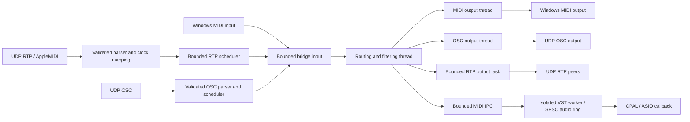

# MIDI/RTP reliability changes

This audit and implementation apply to the local working tree, including the
existing audio/EQ changes. Those changes were preserved. No deployment or release
was performed.

## Architecture and audit priorities

The target is Windows/MSVC with Rust 1.90.0, Tauri 2 and a TypeScript frontend.
Tokio owns network/session and worker-control tasks. `midir` exposes installed
Windows MIDI endpoints; CPAL supplies audio, including ASIO. VST hosting runs in
an isolated child process in production. Virtual MIDI/audio endpoints depend on
installed drivers; the bridge does not create an operating-system MIDI driver.



RTP-origin frames are excluded from RTP forwarding; OSC-origin frames are
excluded from OSC output. Driver sends run in destination threads, GUI events
have a separate emitter, and audio submission uses nonblocking queues. Remaining
participant/send-order async mutexes, configuration locks, callback plugin
`try_lock`, and lifecycle joins are described below; there is no claim that every
operation in this architecture is lock-free.

| Priority | Defects addressed | Verification |
| --- | --- | --- |
| Tier 0: stuck notes / lifetime | Lost critical releases, stale queues after panic, eviction reordering, detached worker tasks, restart-after-stop, session-owner leaks | Overflow and note-accounting tests, worker crash/hang fixtures, cancellation and socket-release tests |
| Tier 1: protocol | Truncated packet acceptance, running status, zero-velocity notes, 14-bit byte order, sequence rollover, CK deadlines, SysEx assembly, OSC padding/timetags | Parser vectors, malformed UDP injection, two-session tests, OSC round trips and scheduled bundles |
| Tier 2: allocation / contention | Repeated packet allocation, callback-list locks, route locks, MIDI submission telemetry locks, per-packet trace formatting | Stable-storage tests, concurrent publication/lock-contention regressions, production-worker telemetry |

Patch boundaries below form the independently committed refactoring roadmap.
The explicit-limits section distinguishes implemented recovery from unsupported
protocol forms and unproven absolute timing or loss guarantees.

## Patch boundaries

1. **Wire parsing:** validate complete packets before dispatch, bound delta-time
   decoding, preserve running status across real-time messages, normalize
   velocity-zero Note-On, fix 14-bit byte order and Z-flag encoding, and reject
   oversized outgoing batches. Packet errors propagate without panicking.
2. **Sessions and timing:** correlate invitations by token and endpoint, validate
   session version and clock count, emit departure events from all removal paths,
   expire invitations and both peer roles, and join registered background tasks.
   CK exchanges now supply monotonic deadlines with bounded integer rate
   compensation. Event deltas accumulate modulo 2^32.
3. **Bridge and destinations:** validate injected frames, use nonblocking fanout,
   invalidate old output generations after a fault, bound each routing batch,
   and track active external MIDI notes in the destination's owning thread.
   Device/filter changes flush notes; hotplug loss triggers recovery. OSC send
   errors propagate, failed sustain sends are not cached, and telemetry cannot
   wait on the activity lock in the routing path.
4. **Worker and exit:** emergency reset travels in the ordered MIDI pipe. Both
   its upstream backlog and the callback's pre-reset ring contents are discarded.
   Tauri exit waits for bridge/audio shutdown, and an RTP session started before
   the bridge is also stopped.
5. **Session ownership follow-up:** only public session handles own the
   cancellation guard. Dropping a value clone does not cancel surviving owners,
   while dropping the last owner cancels background contexts. Graceful stops
   serialize, join reception and maintenance tasks before draining peers, clear
   pending invitations, and prevent invitations on stopped sessions. BY uses
   best-effort nonblocking UDP sends so socket pressure cannot delay shutdown.
   Sequence history lives inside each participant, eliminating a separate map
   allocation and mutex on reception. One immutable listener snapshot covers each packet;
   peer-state locks are released before callbacks. Reconnecting the same SSRC
   resets sequence history, verified through UDP injection.
   Port zero now reserves an actual adjacent ephemeral control/MIDI pair, with
   bounded retries on adjacent-port contention, and advertises its bound control
   port. Invalid port 65535 returns an error without trace-field overflow. The
   logging example now handles Ctrl+C on both Windows and Unix.
6. **Regression harness:** malformed byte campaigns, real UDP session injection,
   sequence gaps/rollover/late packets, timestamp vectors, real-time interleaving,
   10,000 matched note lifecycles through bounded queues, output overflow,
   ordered IPC reset, callback backlog invalidation, and OSC byte alignment and
   round trips. Session regressions also verify retained clones communicate
   after the original is dropped, final-owner drop releases ports, and concurrent
   graceful stops both wait for registered tasks.

## Interfaces and runtime policy

- Worker protocol **8** requires the matching worker executable. A one-byte
  System Reset on the private MIDI pipe requests a callback reset; it is not
  passed to the instrument as an ordinary channel message. Rebuild both packaged
  worker architectures before creating a release.
- The vendored `TimestampedMidiMessage` includes a monotonic `deadline`.
  `StreamFaultEvent` identifies malformed traffic from an established endpoint
  so a corrupt final Note-Off does not require another packet to trigger recovery.
- Public bridge injection reports invalid input and queue exhaustion as errors.
  Audio output metrics count accepted submissions, not failed attempts or proof
  of physical playback.
- RTP scheduling uses a preallocated 4,096-entry heap, with stable ordering for
  equal deadlines. The fixed 3 ms delay was removed. Unsynchronized peers use
  arrival time plus intra-packet deltas until a clock exchange completes.
  Messages more than 10 seconds ahead are rejected, not played prematurely.
- Pending invitations expire after 30 seconds and are capped at 256; connected
  peers are capped at 128. Both session roles expire after 60 seconds without a
  valid synchronization packet, checked on the 10-second maintenance cycle.
- Journals now validate container lengths, channel ordering, and channel
  chapter boundaries. A covering journal containing Chapters N/W/T/A can repair
  missing NoteOffs, recommended missing NoteOns, pitch wheel and pressure state;
  known active notes are not retriggered. Stale X-marked poly pressure is skipped. Ambiguous sustain is released before repaired NoteOffs. Other
  chapter combinations and insufficient checkpoint coverage retain the reset
  fallback. System and parameter journal internals are not yet fully decoded.
- A proven forward sequence gap without supported recovery triggers a reset;
  late/duplicate packets are discarded. There is no added sequence
  reorder delay. This preserves the latency policy at the cost of interrupted
  notes when the network reorders packets.
- A reset intentionally releases all destinations rather than attempting to
  reconstruct musical intent from missing messages. Queue pressure can still
  drop events; reset generations prevent replay of obsolete queued Note-Ons.
- `midi-types` 0.2.1 is vendored with two corrected assertions for valid value
  127. See `vendor/midi-types/PATCHES.md`; all three Cargo roots use this patch.

## Validation

Run from the repository root with the installed CMake and libclang on the process
environment. For tests/checks without packaged sidecars, use the same
`TAURI_CONFIG={"bundle":{"externalBin":[]}}` override as the worker preparation
script. This changes build inputs only, not the tracked application config.

```text
cargo test --manifest-path vendor/rtpmidi/Cargo.toml --locked --tests
cargo clippy --manifest-path vendor/rtpmidi/Cargo.toml --locked --tests -- -D warnings
cargo test --manifest-path src-tauri/Cargo.toml --locked --all-targets --all-features
cargo clippy --manifest-path src-tauri/Cargo.toml --locked --all-targets --all-features -- -D warnings
cargo fmt --manifest-path src-tauri/Cargo.toml --all -- --check
cargo fmt --manifest-path vendor/rtpmidi/Cargo.toml -- --check
npm run lint
npm test
npm run build
```

Frontend validation used the installed Node 26 runtime; the machine's default
Node 20 does not satisfy the existing Vite/jsdom dependency requirements.

The final Windows Rust validation passed 147 application tests and 55 vendored
RTP tests. Three opt-in third-party instrument tests remain ignored. Application
and RTP Clippy checks passed with warnings denied, as did formatting checks.
The rebuilt production worker and diagnostic then passed a fresh 10,000-note
Splice/Voicemeeter run; its raw JSON is tracked in `docs/measurements/`.

## Explicit limits

This is a reliability pass over implemented routes, not a certification of full
RFC 6295/OSC support. Recovery currently supports Chapters N/W/T/A. Program, controller, parameter,
additional-note and system recovery chapters still use the conservative reset fallback. Complete RTP SysEx is forwarded to local MIDI
through the synchronized scheduler. A new borrowed timestamped event carries the
SSRC, RTP timestamp and monotonic deadline while retaining the legacy callback.
Reassembled SysEx uses the final segment deadline; this whole-message MIDI API
does not preserve inter-octet timing inside segmented commands. Segmented
SysEx is reassembled per participant in a preallocated 64 KiB payload buffer;
only completed messages are delivered. Cancellation, corruption, packet loss,
non-real-time interruption, and a 10-second inter-fragment timeout discard the
partial command. Missing fragments are not reconstructed from journals. The
F5 dropped-EOX representation is normalized to a completed SysEx for MIDI APIs. Channel
voice messages use the same synchronized scheduler. UDP regression covers complete
and segmented SysEx delta times across timestamp rollover. Per-message packet/MIDI
trace formatting was removed from the vendor receive and send paths.
Malformed/duplicate packet diagnostics are sampled at power-of-two rejection
counts, so an error flood does not format a log for every datagram.

The application shares its atomic reset generation with RTP sessions. Before
processing another packet, each participant invalidates pre-reset note and SysEx
state. A UDP regression checks that an unchanged generation suppresses duplicate
journal Note-Ons, while a destination reset permits the journal to restore the
note. This tracks receiver knowledge, not acknowledgement of physical playback;
queued events can still be invalidated by subsequent overload recovery.

The 10,000-note regression exercises the actual bounded enqueue/fanout functions
and destination note tracking in a headless harness. It does not replace a
hardware/driver test. The existing ASIO/VST tests requiring installed instruments
remain opt-in. Three production-worker runs with the requested Splice/Voicemeeter
rig completed 10,000 notes each; see [measurements and reproduction](AUDIO_RELIABILITY_RESULTS.md).
No hard sub-millisecond or zero-network-loss claim follows from
these results: driver timing, Windows wake-up jitter, UDP delivery, and physical
disconnect recovery require measurements on the intended rig.

Protocol references: [RFC 6295](https://www.rfc-editor.org/rfc/rfc6295),
[Apple MIDI Network Driver Protocol](https://developer.apple.com/library/archive/documentation/Audio/Conceptual/MIDINetworkDriverProtocol/MIDI/MIDI.html),
and [OSC 1.0](https://opensoundcontrol.stanford.edu/spec-1_0.html).

## OSC input

OSC input is optional (off by default), configurable in the OSC page, and binds
127.0.0.1:9001 by default. Exact `/avatar/parameters/1` through `88` and `sustain`
accept a single zero/one integer or float, or OSC True/False. Notes map to MIDI
channel 1 and velocity 127. `/midi` accepts one OSC `m` argument with explicit
status and zero-filled unused data bytes; the port-id byte is not routed.
Input events are forwarded to MIDI/audio and suppressed on OSC output to prevent
feedback. OSC input does not require OSC output to be enabled.

The decoder validates i/f/s/b/h/t/d/m/T/F/N/I argument layouts, ASCII strings,
zero padding, complete consumption, signed lengths, and nested bundle ordering.
It reads borrowed packet slices and rejects a malformed packet before queuing
any of its events. Unknown exact addresses are ignored after validation;
address-pattern dispatch and array type tags are not implemented.

An input packet is limited to 1,024 mapped messages and 16 nested levels; the
scheduler holds at most 4,096 events and accepts deadlines up to ten seconds
in the future. NTP era rollover is handled using integer arithmetic. Immediate
nested bundles inherit their parent deadline. Due events are submitted in wire
order, and reception remains asynchronous while future bundles wait. This does
not provide transactional isolation from other MIDI producers in the shared
bridge queue or guarantee physical microsecond wake-up accuracy.

UDP tests cover timed/immediate interleaving, ordering and port release. Codec
tests cover all requested atomic layouts, truncation, padding, nested deadline
violations, capacity rejection, and NTP era rollover. Config changes replace the
input server with validation of its new bind address before stopping the old one.

## RTP output

The RTP page now offers an independent forwarding switch (off by default).
Local MIDI, injected events and OSC input can be forwarded to connected peers;
RTP-origin events are not echoed. Source routing profiles are applied before
forwarding. Output uses a separate bounded 2,048-frame queue and worker, with
nonblocking route lookup/submission on the processing path. Overflow is counted;
a lost critical release requests recovery. Reset generations discard stale work.

The sender releases sustain/notes/sound on all channels when a previously used
outbound route resets or stops, before session BY. An unused outbound route does
not send these controller resets. Socket operations are bounded by a 100 ms
failure timeout; failed resets are retried before new notes are sent. SysEx up
to 64 KiB is split into 1,024-byte RTP sublists and reassembled by the receiver.
The vendor sender snapshots only peer addresses in fixed storage, avoiding
copies of participant names and SysEx buffers for every outgoing packet.
The packet encoder now reuses a preallocated 1,214-byte buffer under the existing
send-order mutex. A 10,000-encode regression checks stable storage at maximum
packet size and rejection before mutation for oversized batches. This removes
the encoded-packet allocation; the async send-order and participant locks remain; listener and route reads use atomic snapshots.

A two-session regression verifies MIDI forwarding, 2,700-byte segmented SysEx,
and remote panic. Queue tests cover echo prevention, critical overflow and a
concurrent configuration publication. The output worker checks reset generations on
a two-millisecond maintenance tick; no sub-millisecond reset bound is claimed.

## Configuration failure recovery

User save, reset and import operations serialize their bridge configuration
changes. OSC binding and RTP application precede the atomic configuration-file
write. A failed apply or write attempts to restore the previous runtime settings;
if restoration also fails, the returned error includes `rollbackError` alongside
the original error. Logging and discovery changes follow a successful commit.
Regression tests exercise an occupied UDP port, failed persistence, successful
persistence, and failed rollback. Recovery may interrupt sounding notes and may
fail if another process has occupied the previous port; this is not a guarantee
of uninterrupted reconfiguration. Instrument loading after import remains a
separate operation with its own error reporting.

RTP input and output routes now publish sender snapshots through ArcSwapOption.
Readers do not wait on configuration writers or drop messages merely because a
writer owns a lock. A concurrent route-swap regression delivers all 1,000 test
frames without requesting a reset. Queue exhaustion and route removal still have
the documented drop/reset policies.

Listener registration uses copy-on-write ArcSwap snapshots. A packet holds one
consistent callback list, while concurrent registration preserves all additions.
Callbacks now require `Send + Sync` because control and data notifications may
run concurrently; consumers must keep callbacks bounded. A regression retains an
old snapshot during four concurrent writers and verifies all 64 registrations
are present afterward. Publication allocates on the registration path; ordinary
notification does not clone the callback vectors. The participant-state and
outbound send-order mutexes still exist. ArcSwap's read guarantees are documented
by the [crate author](https://docs.rs/arc-swap/1.9.2/arc_swap/docs/performance/index.html).

## Audio overload and worker ownership

Audio backlog eviction preserves queue order. Previously, swapping an evicted
Note-On with the queue front could move a Note-Off behind sustain-on, keeping a
voice sounding. Regression tests cover both Note-On and controller eviction
without growing the preallocated queue. The direct-engine MIDI route is now an
atomic snapshot with a nonblocking producer guard and atomic drop telemetry.
The 64 yield/retry loop, runtime-mutex telemetry access and per-submission debug
formatting were removed. Producer contention or exhaustion requests an atomic
reset for critical releases. This bounds the submission path, not delivery under
unbounded load. Stable eviction remains linear in the bounded queue length.

Private audio packets and IPC frames validate complete short MIDI messages and
normalize velocity-zero Note-On. They reject malformed lengths/data and SysEx
instead of silently truncating a SysEx into the three-byte audio packet format.
SysEx still uses the external MIDI destination path; this does not add SysEx
instrument hosting support.

The worker supervisor also publishes its MIDI sender atomically and counts drops
without acquiring control/status locks. Lifecycle operations serialize; an epoch
invalidates delayed automatic restarts after explicit stop or a newer start.
Graceful stop waits for the session task after the audio acknowledgement and
aborts it on failure/timeout. Session pipe tasks are cancelled and joined on
normal teardown; cancellation also aborts their guards. Pending connection tasks
are cancelled if their starting future is dropped. Only public supervisor clones
retain the cancellation owner: dropping the last public owner aborts the active
session even if internal background contexts still exist. Child-process teardown
kills and reaps the worker even when job assignment was unavailable.
Cancelling an in-progress Stop also aborts its locally owned session task, rather
than detaching it when the control future is dropped.

Tests cover control/status/producer lock contention, deferred restart invalidation,
waiting past Stop acknowledgement, retained owner clones and final-owner
cancellation, in addition to the existing real worker crash/hang fixtures.
Control-stop acknowledgement and session joining each have a ten-second timeout;
a stop waiting for an in-progress load may also wait on that load's timeout.
These are bounded fallback policies, not a hard real-time shutdown guarantee.
